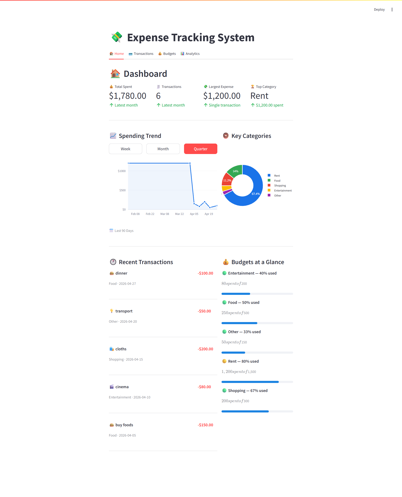

# 💸 Expense Management System

An end-to-end **Expense Management System** built with a **microservices-inspired architecture** using **FastAPI** for RESTful backend APIs and **Streamlit** for an interactive frontend UI. Designed to help users **track**, **categorize**, and **analyze** their expenses in real-time with an intuitive interface and robust API layer.

---

## 🔧 Tech Stack

- **Frontend**: [Streamlit](https://streamlit.io/) – Rapid UI development for Python-based dashboards
- **Backend**: [FastAPI](https://fastapi.tiangolo.com/) – High-performance asynchronous API framework
- **ASGI Server**: [Uvicorn](https://www.uvicorn.org/) – Lightweight, production-grade ASGI server
- **Data Models**: [Pydantic](https://docs.pydantic.dev/) – Data validation using Python type hints
- **HTTP Requests**: [Requests](https://requests.readthedocs.io/)
- **Testing**: [Pytest](https://docs.pytest.org/en/stable/)
- **Architecture**: Modular structure with loose coupling between frontend and backend

---

## 🗃️ Project Structure

expense-management-system/
├── backend/ # FastAPI backend for handling API requests
│ └── server.py # Entry point of backend app
├── frontend/ # Streamlit-based UI for user interaction
│ └── app.py # Entry point of frontend app
├── tests/ # Unit and integration test cases
├── requirements.txt # Python dependencies
└── README.md # Project documentation


---

## 🚀 Features

- 🔐 Stateless API layer following REST principles
- 🧾 Expense creation, retrieval, update, and deletion (CRUD)
- 📊 Real-time summary views and visual analytics by category/date
- 🧠 Data validation with Pydantic models
- 🔄 Asynchronous request handling using `async`/`await`
- ✅ Automated tests for backend routes and frontend components
- 🔌 Easily extensible for database or authentication layer

---

## 📷 Screenshots

### 📊 Dashboard View


### ➕ Add Expense Page


## Setup Instructions

1. **Clone the repository**:
   ```bash
   git clone https://github.com/himelds/expense-management-system.git
   cd expense-management-system
   ```
2. **Install dependencies:**:   
   ```commandline
    pip install -r requirements.txt
   ```
3. **Run the FastAPI server:**:   
   ```commandline
    uvicorn server:app --reload
   ```
4. **Run the Streamlit app:**:   
   ```commandline
    streamlit run frontend/app.py