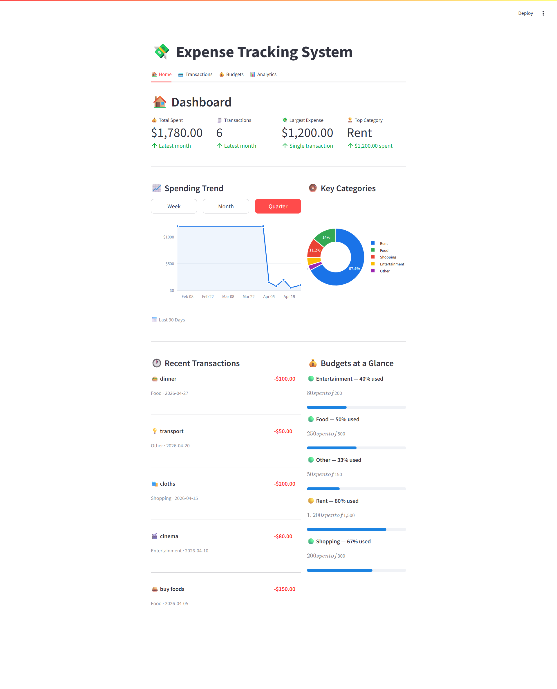
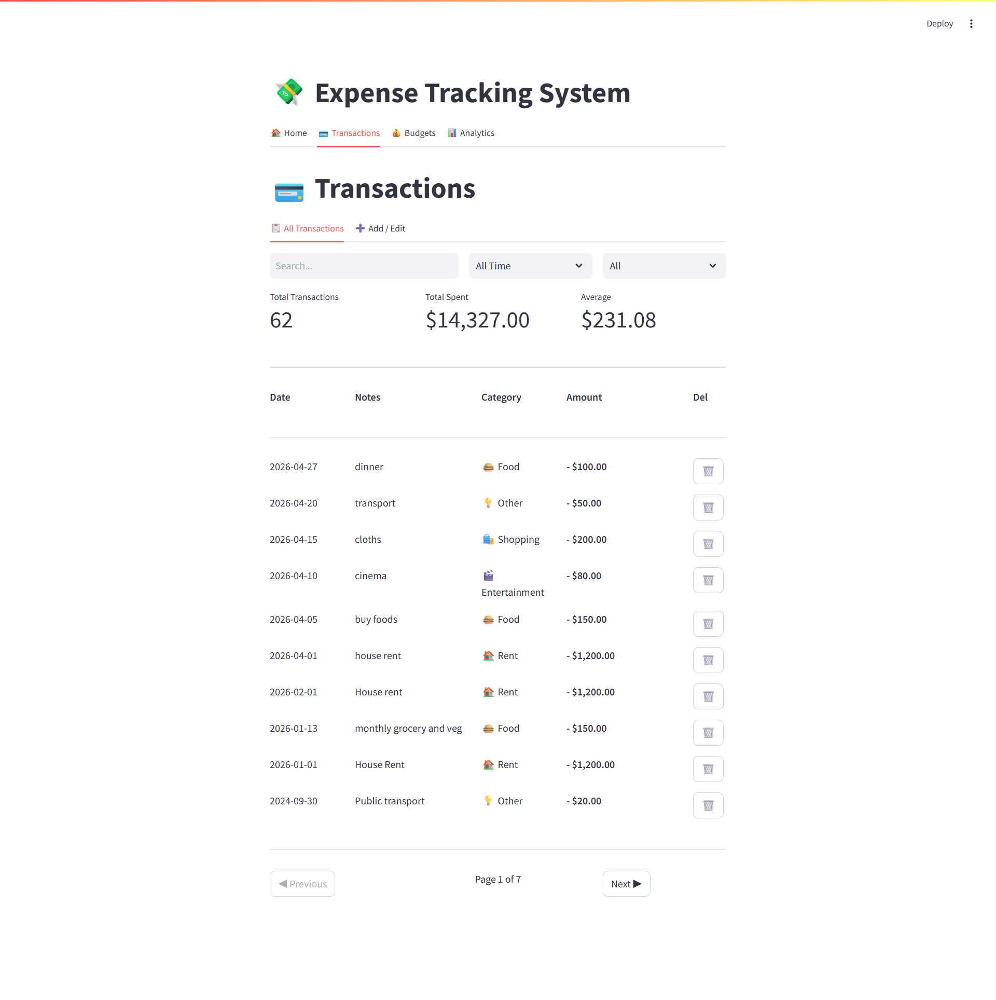
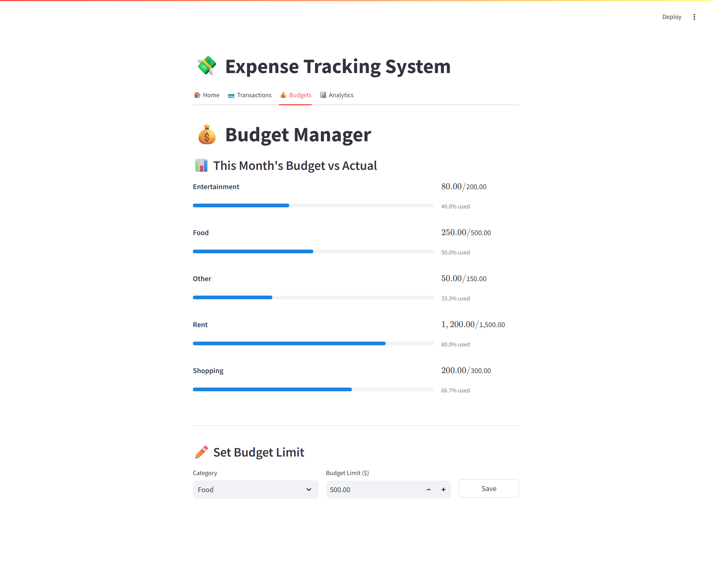
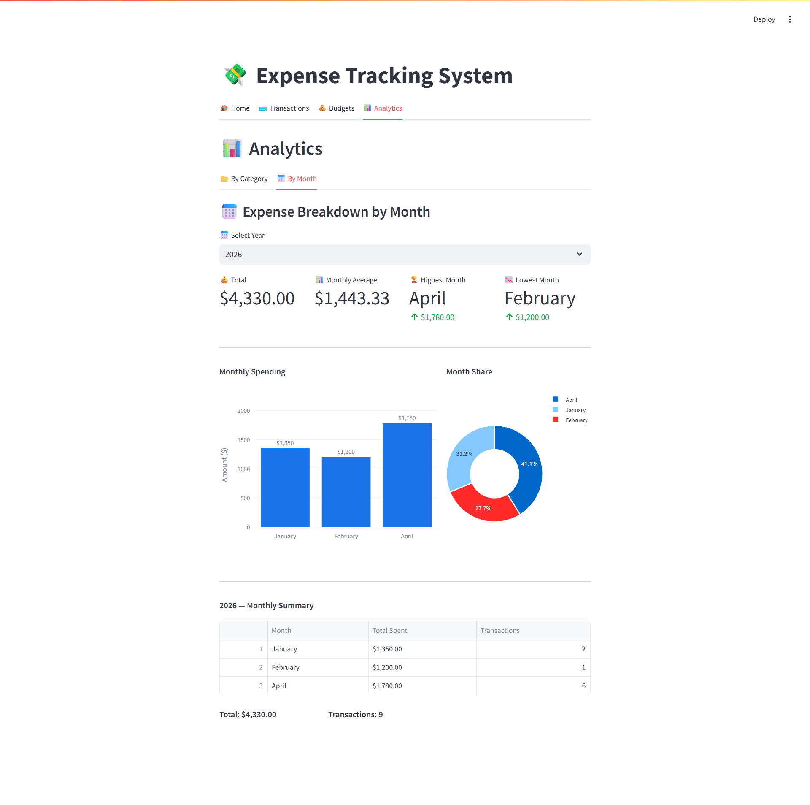

# 💸 Expense Tracking System

A full-stack **Expense Tracking System** built with **FastAPI** backend and **Streamlit** frontend. Helps users track, categorize, budget, and analyze their expenses with an interactive dashboard and clean UI.

---

## 📷 Screenshots

### 🏠 Dashboard


### 💳 Transactions


### 💰 Budget Manager


### 📊 Analytics


---

## 🔧 Tech Stack

| Layer | Technology |
|---|---|
| Frontend | Streamlit |
| Backend | FastAPI + Uvicorn |
| Database | MySQL 8.0 |
| Data Models | Pydantic v2 |
| Charts | Plotly |
| HTTP | Requests |
| Testing | Pytest |

---

## 🗃️ Project Structure

```
Expense tracking system/
├── backend/
│   ├── server.py          # FastAPI app & all API endpoints
│   ├── db_helper.py       # All MySQL queries & DB logic
│   └── logging_setup.py   # Logger configuration
├── frontend/
│   ├── app.py             # Main Streamlit app & tab routing
│   ├── home.py            # Dashboard tab
│   ├── add_update.py      # Transactions tab
│   ├── budgets.py         # Budget manager tab
│   └── analytics.py       # Analytics tab (by category & month)
├── database/
│   └── expense_db_creation.sql
├── tests/
├── requirements.txt
└── README.md
```

---

## 🚀 Features

### 🏠 Dashboard
- Summary metrics — Total spent, Transactions, Largest expense, Top category
- Spending trend line chart with **Week / Month / Quarter** filter
- Key categories donut chart
- Recent transactions list (latest 5)
- Budgets at a glance with color-coded progress bars

### 💳 Transactions
- View all transactions with search, filter by category, week, month, year
- Paginated transaction list with delete option
- Add/update expenses by date
- Add custom categories

### 💰 Budget Manager
- Set budget limits per category
- Visual progress bars with 🟢 🟡 🔴 status indicators
- Over-budget alerts

### 📊 Analytics
- **By Category** — Bar chart + donut chart + detailed table for any date range
- **By Month** — Year filter, monthly bar chart, month share donut, sortable table

---

## ⚙️ Setup Instructions

### Prerequisites
- Python 3.11+
- MySQL 8.0

### 1. Clone the repository
```bash
git clone https://github.com/himelds/Expense-Management-System.git
cd "Expense-Management-System"
```

### 2. Install dependencies
```bash
pip install -r requirements.txt
```

### 3. Configure MySQL

Login to MySQL and run:
```sql
ALTER USER 'root'@'localhost' IDENTIFIED WITH mysql_native_password BY 'your_password';
FLUSH PRIVILEGES;
```

Then update your credentials in `backend/db_helper.py`:
```python
connection = mysql.connector.connect(
    host="localhost",
    user="root",
    password="your_password",   # ← change this
    database="expense_manager"
)
```

### 4. Start the backend
> ⚠️ Always run from the **project root**, not inside the `backend/` folder.

```bash
uvicorn backend.server:app --reload
```

### 5. Start the frontend
```bash
streamlit run frontend/app.py
```

### 6. Open in browser
- Streamlit UI → http://localhost:8501
- FastAPI docs → http://127.0.0.1:8000/docs

---

## 🗄️ Database

The database and tables are **auto-created** on first startup via `init_db()` in `db_helper.py`. No manual SQL setup needed.

Tables created automatically:
- `expenses` — all expense records
- `budgets` — budget limits per category
- `categories` — custom user-defined categories

To load sample data manually:
```bash
mysql -u root -p < database/expense_db_creation.sql
```

---

## 📡 API Endpoints

| Method | Endpoint | Description |
|---|---|---|
| GET | `/expenses/{date}` | Get expenses for a date |
| POST | `/expenses/{date}` | Add/update expenses for a date |
| DELETE | `/expenses/{id}` | Delete a single expense |
| GET | `/all_expenses/` | Get all expenses with filters |
| GET | `/monthly_summary/` | Monthly expense summary |
| POST | `/analytics/` | Category breakdown for date range |
| GET | `/home_summary/` | Dashboard summary data |
| GET | `/spending_trend/` | Daily totals for trend chart |
| GET | `/budgets/` | Get all budgets |
| POST | `/budgets/` | Set/update a budget |
| GET | `/budgets/vs_actual/` | Budget vs actual spending |
| GET | `/categories/` | Get all categories |
| POST | `/categories/` | Add a new category |

---

## 🐛 Known Issues & Fixes

**Q: `ModuleNotFoundError: No module named 'db_helper'`**
Run uvicorn from the project root with `uvicorn backend.server:app --reload`

**Q: `Status 500` on all API calls**
Check MySQL is running and credentials in `db_helper.py` are correct. Also run:
```sql
ALTER USER 'root'@'localhost' IDENTIFIED WITH mysql_native_password BY 'your_password';
FLUSH PRIVILEGES;
```

---

## 📦 Requirements

```
streamlit==1.40.1
fastapi==0.115.8
pydantic>=2.0.0
uvicorn==0.33.0
mysql-connector-python==9.0.0
pandas==2.2.3
requests==2.31.0
plotly>=5.0.0
pytest==8.3.4
```
